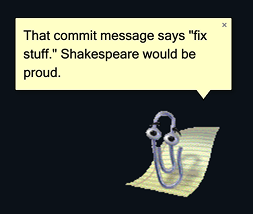

# Clippy Agent

<p align="center">
  
</p>

**Add Clippy or his friends to any website for instant nostalgia. Now with optional AI powers.**

Modernized fork of the original [ClippyJS](https://github.com/clippyjs/clippy.js) — zero dependencies, TypeScript, ES modules. Includes a Chrome Extension with optional AI features powered by any OpenAI-compatible gateway.

[](https://www.npmjs.com/package/clippy-agent)
[](./MIT-LICENSE.txt)
[](https://www.typescriptlang.org/)

---

## Chrome Extension

The Chrome Extension puts Clippy (or any of the 10 agents) on every webpage you visit. It works in two modes:

### Classic Mode (no setup required)

Clippy appears on every page with **canned context-aware quips** — he roasts your emails on Gmail, judges your code on GitHub, questions your purchases on Amazon, and more. All 10 original agents included.

- **Click** Clippy to play a random animation
- **Double-click** for a random animation
- **Drag** him anywhere on the page
- **Right-click** to switch agents or hide him

### AI Mode (optional)

Connect Clippy to any **OpenAI-compatible API** and he becomes actually useful:

- **Click Clippy** to open a smart menu with contextual options based on the site you're on:
  - GitHub: "Explain this code", "Review this PR"
  - Gmail: "Help me write this", "Summarize inbox"
  - Amazon: "Is this worth it?"
  - YouTube: "Is this worth watching?"
  - Stack Overflow: "Explain the answer"
  - Plus "Summarize this page" and a free-text input on every site
- **Select text + right-click** "Ask Clippy about this" for instant explanations
- **Smart quips** — instead of canned jokes, Clippy generates context-aware commentary about the page you're on
- **Works with any OpenAI-compatible backend** — OpenClaw, LiteLLM, Ollama, OpenRouter, or the OpenAI API directly

### Install the Extension

1. Download or clone this repo
2. Open `chrome://extensions` in Chrome
3. Enable **Developer mode** (top-right toggle)
4. Click **Load unpacked** and select the `extension/` folder
5. Clippy appears! He works immediately with canned quips — no setup needed

### Enable AI Features

1. Click the Clippy extension icon in Chrome's toolbar
2. Check **"Enable AI features"**
3. Enter your **Gateway URL** (e.g. `http://localhost:18789` or your remote gateway)
4. Enter your **Gateway Token** (bearer auth token)
5. Click **Test Connection** to verify
6. Click **OK** to save
7. Now click Clippy on any page to ask questions!

**Compatible gateways:**
- [OpenClaw](https://github.com/good3n/openclaw) (self-hosted, recommended)
- Any OpenAI-compatible API (`/v1/chat/completions` endpoint)
- OpenRouter, Together AI, Ollama, LiteLLM, etc.

The extension sends requests to `POST /v1/chat/completions` with standard OpenAI chat format. Any backend that supports this works.

---

## npm Package

The npm package is the core library for embedding Clippy in your own web projects.

### Install

```bash
npm install clippy-agent
```

Or via CDN:

```html
<script type="module">
  import { load } from 'https://unpkg.com/clippy-agent@2/dist/index.js';

  const agent = await load('Clippy');
  agent.show();
  agent.speak('Hello! I see you\'re browsing the web. Need help?');
</script>
```

### Quick Start

```typescript
import { load } from 'clippy-agent';

const agent = await load('Clippy');
agent.show();
agent.speak('It looks like you\'re writing a letter. Would you like help?');
agent.play('Searching');
agent.moveTo(200, 300);
agent.animate();
```

### API

#### `load(name, config?)`

Load an agent. Returns a `Promise<Agent>`.

```typescript
const agent = await load('Clippy');

// With config
const agent = await load('Merlin', {
  basePath: '/my-custom-agents',
  sounds: false,
});
```

#### Agent Methods

| Method | Description |
|--------|-------------|
| `agent.show(fast?)` | Show the agent. Pass `true` to skip animation. |
| `agent.hide(fast?, callback?)` | Hide the agent. |
| `agent.speak(text, hold?)` | Show a speech bubble. Pass `hold: true` to keep it visible. |
| `agent.closeBalloon()` | Close the speech bubble. |
| `agent.play(animation, timeout?, cb?)` | Play a specific animation. |
| `agent.animate()` | Play a random animation. |
| `agent.moveTo(x, y, duration?)` | Move agent to coordinates. |
| `agent.gestureAt(x, y)` | Gesture toward a point. |
| `agent.stopCurrent()` | Stop the current animation. |
| `agent.stop()` | Stop all animations and clear the queue. |
| `agent.animations()` | Get list of available animation names. |
| `agent.hasAnimation(name)` | Check if an animation exists. |
| `agent.pause()` | Pause all animations. |
| `agent.resume()` | Resume animations. |
| `agent.delay(ms?)` | Add a delay to the action queue. |
| `agent.destroy()` | Remove agent from the DOM entirely. |

#### Action Queue

All actions are queued and executed in order:

```typescript
agent.speak('Let me search for that...');
agent.play('Searching');
agent.speak('Found it!');
agent.play('Congratulate');
```

### Available Agents

| Agent | Description |
|-------|-------------|
| **Clippy** | The classic paperclip |
| **Bonzi** | The purple gorilla |
| **F1** | The robot |
| **Genie** | The lamp genie |
| **Genius** | The Einstein-like character |
| **Links** | The cat |
| **Merlin** | The wizard |
| **Peedy** | The parrot |
| **Rocky** | The dog |
| **Rover** | The search dog |

### Custom Agent Path

By default, agent assets are loaded from unpkg CDN. You can self-host them:

```typescript
const agent = await load('Clippy', {
  basePath: '/assets/agents'
});
```

### TypeScript

Full type definitions included:

```typescript
import { load, type Agent, type AgentName } from 'clippy-agent';

const agentName: AgentName = 'Clippy';
const agent: Agent = await load(agentName);
```

## Browser Support

Works in all modern browsers (Chrome, Firefox, Safari, Edge).

## Credits

- Original [ClippyJS](https://github.com/clippyjs/clippy.js) by [Smore](https://www.smore.com/clippy-js)
- [Cinnamon Software](http://www.cinnamonsoftware.com/) for [Double Agent](http://doubleagent.sourceforge.net/) (used to extract the original sprites)
- Microsoft, for creating Clippy

## License

[MIT](./MIT-LICENSE.txt)
